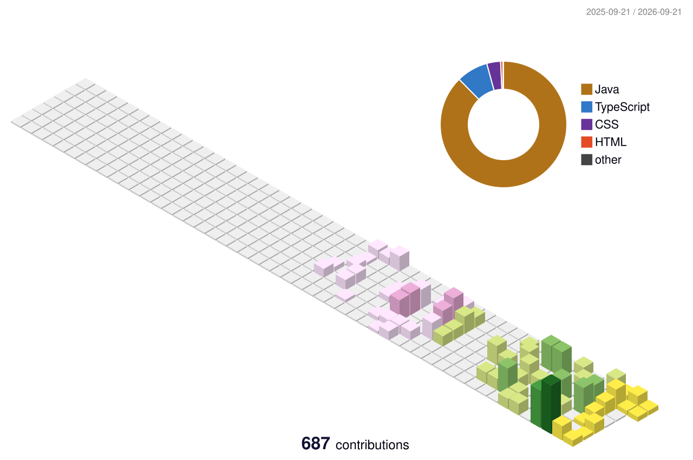

<div align="center">

<picture>
<source media="(prefers-reduced-motion: reduce)" srcset="./assets/hero-static.svg" />

</picture>

<picture>
<source media="(prefers-reduced-motion: reduce)" srcset="./assets/typing-static.svg" />

</picture>

**哈尔滨工业大学（深圳）本科生 · AI 应用开发实习 · 深圳**

<a href="https://pmsjl.github.io/portfolio/"></a>
<a href="https://github.com/pmsjl"></a>
<a href="mailto:2024311001@stu.hit.edu.cn"></a>
<a href="https://pmsjl.github.io/portfolio/assets/resume.pdf"></a>
<br/>

<a href="mailto:2024311001@stu.hit.edu.cn"></a>

</div>

## 01 / About me

我是徐俊杰，目前在哈尔滨工业大学（深圳）就读，主要使用 **Java 和 Python** 开发后端，正在围绕具体业务实践 **Agent、RAG 和 AI 辅助开发**。

从校园二手交易中的智能导购，到为记忆研究搭建数据采集平台，我喜欢把想法做成可以实际体验的应用。除了功能本身，我也关心模型的回答有没有依据、业务数据是否一致，以及应用上线后能否继续维护。

```python
class JunjieXu:
    location = "Shenzhen, China"
    education = "HIT Shenzhen · Undergraduate · 2024–2028"
    backend = ["Java", "Spring Boot", "Python", "FastAPI"]
    focus = ["Agents", "RAG", "Evaluation", "Application delivery"]
    building = ["Sharing Market", "Verbal Memory"]
    open_to = "AI Application Development Internships"

    def development_loop(self):
        return "Understand → Build → Verify → Deploy → Iterate"
```

- **后端基础：** 业务接口、订单与库存、余额一致性、并发会话及调用额度。
- **AI 应用实践：** 结构化路由、受控工具调用、检索增强、引用校验与会话管理。
- **验证习惯：** 通过接口联调、实际运行、代码审查和失败案例分析迭代实现。

<picture>
<source media="(prefers-reduced-motion: reduce)" srcset="./assets/divider-static.svg" />

</picture>

## 02 / Selected work

### 智能校园二手交易平台

**校园交易业务 × AI 导购**

用户可以用自然语言描述购买需求，查询真实在售商品，并结合平台规则、课程资料和社区经验获取带来源引用的购买建议。平台同时覆盖商品发布、订单交易、校园币模拟支付、帖子互动和私信等业务。

- **业务与 Agent 协作：** Spring Boot 管理业务数据和会话，FastAPI 编排模型；通过 Tool Calling 接入商品搜索和脱敏偏好工具。
- **路由与证据：** 实现规则 Guardrail、结构化 LLM Router、失败降级、FAISS 检索和服务端引用校验。
- **知识与评测：** 构建 **359 篇文档 / 1,611 个片段**的知识库和 **200 条人工复核 Case**，通过回归评测定位路由、检索与回答边界问题。
- **工程细节：** 处理库存条件扣减、幂等流水、并发会话、滚动摘要、Tool Trace 和用户/平台双层调用额度。

`Java` `Python` `Spring Boot` `FastAPI` `MySQL` `Redis` `Vue` `FAISS`

**[在线体验 ↗](https://market.pmsjl.com/)** · [源码](https://github.com/pmsjl/sharing-market)

---

### Verbal Memory 测试平台

**研究需求 × AI 辅助全栈交付**

面向音乐条件与英语单词短时记忆研究的数据采集平台，支持音乐/无音乐条件测试、实验记录管理与 CSV 导出。

- **实验流程：** 完成被试信息填写、实验准备、NEW/SEEN 单词判别和结果提交，采集分数、完成时长及音乐习惯信息。
- **全栈实现：** 基于 React、TypeScript、Spring Boot 与 MySQL 完成页面、接口和数据存储；使用 Codex、Claude Code 辅助开发，通过实际运行、联调和人工审查验证代码。
- **部署与交付：** 后端镜像本地构建，通过 Docker Compose 在阿里云 ECS 部署后端和 MySQL，使用数据卷持久化。
- **访问与更新：** Cloudflare Tunnel 提供后端 HTTPS 访问，前端通过 Cloudflare Pages 实现 Git 推送触发自动构建部署。

`React` `TypeScript` `Spring Boot` `MySQL` `Docker Compose` `Cloudflare`

**[在线体验 ↗](https://verbal.pmsjl.com/)** · [源码](https://github.com/pmsjl/verbal_test)

---

### AircraftGame

基于 Java Swing 的飞机大战，包含三档难度、Boss 战、多种敌机与道具，以及排行榜持久化。

在游戏循环、射击方式和对象创建中实践面向对象设计与设计模式。

`Java` `Swing` `OOP`

[源码 ↗](https://github.com/pmsjl/AircraftGame)

<picture>
<source media="(prefers-reduced-motion: reduce)" srcset="./assets/divider-static.svg" />

</picture>

## 03 / Technologies & practice

以下来自项目中的实际使用；后端是主要方向，前端侧重页面实现、代码阅读和接口联调。

| 方向 | 技术与实践 |
| :--- | :--- |
| 后端开发 | Java · Python · Spring Boot · FastAPI · MyBatis-Plus |
| AI 应用 | Responses API · Structured Outputs · Tool Calling · RAG · Embeddings · FAISS |
| 数据与状态 | MySQL · Redis · 幂等处理 · 会话持久化 |
| 前端实践 | React · Vue · TypeScript · Vite |
| 部署与交付 | Docker Compose · 阿里云 ECS · Cloudflare Pages / Tunnel |
| 开发与验证 | Git · Linux 常用命令 · Apifox · 代码审查 · 回归评测 |
| AI 编码工具 | Codex · Claude Code |

## 04 / What I'm exploring

**Agent 如何接入真实业务？** 让模型负责语义判断，程序控制工具策略和执行边界，并对商品、帖子与引用结果进行校验。

**RAG 的问题究竟出在哪一环？** 结合课程关系、候选证据和失败案例，区分路由、检索、标注与生成问题，再通过固定评测集回归验证。

**如何把 AI 辅助编码变成可维护的交付？** 在需求拆解、编码与调试中使用 AI 工具，同时保留代码阅读、接口联调、实际运行和部署验证。

## 05 / Achievements

- **国家级三等奖** · 2025 年度“挑战杯”中国青年科技创新“揭榜挂帅”擂台赛。
- **省级二等奖** · 2025 年第十七届全国大学生数学竞赛。
- **优秀学生、学业三等奖学金** · 哈尔滨工业大学（深圳），2024—2025 学年。
- **优秀团员** · 哈尔滨工业大学（深圳），2025—2026 学年五四表彰。

<picture>
<source media="(prefers-reduced-motion: reduce)" srcset="./assets/divider-static.svg" />

</picture>

## 06 / A little motion, a little progress

### Contribution snake

<picture>
<source media="(prefers-color-scheme: dark)" srcset="./assets/generated/snake-dark.svg" />

</picture>

### Contribution city

<picture>
<source media="(prefers-color-scheme: dark)" srcset="./assets/generated/city-dark.svg" />

</picture>

## 07 / Let's connect

目前寻找 **AI 应用开发实习机会（深圳）**，欢迎通过邮件联系。

**[2024311001@stu.hit.edu.cn](mailto:2024311001@stu.hit.edu.cn)**

<picture>
<source media="(prefers-reduced-motion: reduce)" srcset="./assets/footer-static.svg" />

</picture>
